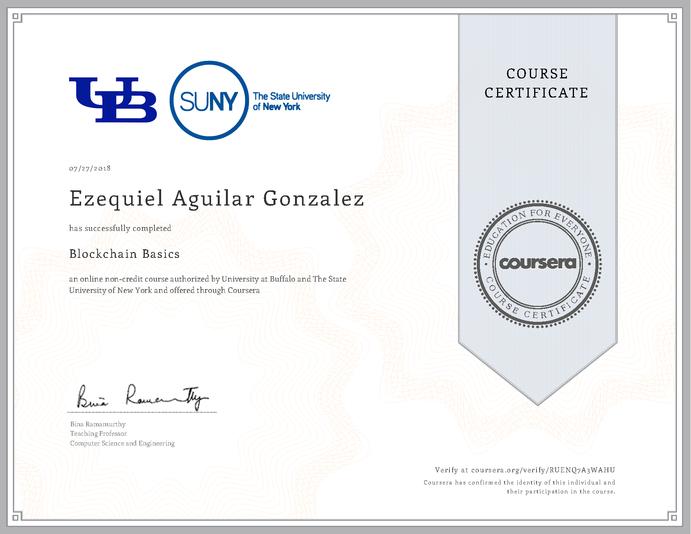

# Course 01 - Blockchain Basic

This first course of the Blockchain specialization provides a broad overview of the essential concepts of blockchain technology – by initially exploring the Bitcoin protocol followed by the Ethereum protocol – to lay the foundation necessary for developing applications and programming. You will be equipped with the knowledge needed to create nodes on your personal Ethereum blockchain, create accounts, unlock accounts, mine, transact, transfer Ethers, and check balances.

Table of contents
=================

<!--ts-->
   * [Certificate](#certificate)
   * [Week 01 Blockchain Defined](#week-01-blockchain-defined)
   * [Week 02 Ethereum Blockchain](#week-02-ethereum-blockchain)
   * [Week 03 Algorithms & Techniques](#week-03-algorithms-techniques)
   * [Week 04 Trust Essentials](#week-04-trust-essentials)

<!--te-->

Certificate
==============

Week 01 Blockchain Defined
==========================
Learning Objectives:
* Explain the three fundamental characteristics that define a Blockchain using Bitcoin Blockchain.
* Discuss the important features of Ethereum Blockchain that is used as reference implementation in many newer Blockchains.
* Outline methods for realizing trust in the Blockchain.

### Resources
| Title of resource | Resource type | Description
| --- | --- |--- |
| [Bitcoin Whitepaper](http://www.bitcoin.org/bitcoin.pdf) | Website | This is paper released by Satoshi Nakamoto prior to release of the now famous cryptocurrency Bitcoin. |
|[Bitcoin's Academic Pedigree](https://queue.acm.org/detail.cfm?id=3136559)|Paper|How Bitcoin, a radically different proposal for a decentralized cryptocurrency showed that digital cash could be viable.|
|[What is Blockchain Technology? A Step-by-Step Guide For Beginners](https://blockgeeks.com/guides/what-is-blockchain-technology/)|Website|A step by step guide that goes into the details of what Blockchain technology is.|
|[Blockchain: The Invisible Technology That's Changing the World](https://www.pcmag.com/article/351486/blockchain-the-invisible-technology-thats-changing-the-wor)|Website|Article that expands on a new immutable digital fabric remaking the internet without people even realizing it. It also shows how Blockchain-based networks, decentralized apps (DApps), and distributed ledgers are becoming the foundation of digital life.|
|[Unspent Transaction Output, UTXO](https://bitcoin.org/en/glossary/unspent-transaction-output)|Website|An online glossary for technical terms regarding Bitcoins. This link Provides the definition and synonyms for an “Unspent Transaction Output”.|
|[Unspent Transaction Output, UTXO](https://www.smithandcrown.com/definition/unspent-transaction-outputs-utxo/)|Website|An explanation on how UTXO’s operate vs other methods.|
|[How the NSA identified Satoshi Nakamoto](https://medium.com/cryptomuse/how-the-nsa-caught-satoshi-nakamoto-868affcef595)|Website|An article written by Alexander Muse on Medium that explains how the NSA identified the creator of Bitcoin, Satoshi Nakamoto.|
|[How a Bitcoin Transaction Works](https://www.ccn.com/bitcoin-transaction-really-works/)|Website|This article explains what a bitcoin transaction is, its purpose and outcome. The explanation in this article is suitable for both novice and intermediate bitcoin users.|
|[How does the Blockchain Work? (Part 1)](https://medium.com/blockchain-review/how-does-the-blockchain-work-for-dummies-explained-simply-9f94d386e093)|Website|An article written by Collin Thompson on Medium that gives a simple and easy explanation on how blockchain works.|
|[How Does the Blockchain Work?](https://medium.com/@micheledaliessi/how-does-the-blockchain-work-98c8cd01d2ae)|Website|An article written by Michele D'Aliessi on Medium that explains blockchain technology in simple words.|
|[A Gentle Introduction to Blockchain Technology](https://bitsonblocks.net/2015/09/09/a-gentle-introduction-to-blockchain-technology/)|Website|This article is a gentle introduction to blockchain technology and assumes minimal technical knowledge. It attempts to describe “what it is” rather than “why should I care”.|
|[On Public and Private Blockchains](https://blog.ethereum.org/2015/08/07/on-public-and-private-blockchains/)|Website|A blog posted by Vitalik Buterin, the founder of Ethereum. He goes on to explain the differences between the different types of blockchains.|
|[What is Cryptocurrency. Guide for Beginners](https://cointelegraph.com/bitcoin-for-beginners/what-are-cryptocurrencies#accept-as-payment-for-business)|Website|An easy to understand guide on cryptocurrencies, including its history and future.|
|[2017 Was Bitcoin's Year. 2018 Will Be Ethereum's](https://www.coindesk.com/2017-bitcoins-year-2018-will-ethereums/)|Website|The following article written by Jez San, CEO of FunFair Technologies, an Ethereum-powered casino platform, explains why Ethereum will continue to evolve throughout the year 2018.|
|[What is Cryptocurrency: Everything You Need To Know](https://blockgeeks.com/guides/what-is-cryptocurrency/)|Website|This introduction explains the most important things about cryptocurrencies and where they are headed.|
|[What is the Difference Between Public and Permissioned Blockchains?](https://www.coindesk.com/information/what-is-the-difference-between-open-and-permissioned-blockchains/)|Website|An article that introduces a description of the three technologies that make up blockchain technology: cryptographic keys, a distributed network and a network servicing protocol.|
|[Blockchain](https://blockchain.info/)|Website|Blockchain is the world's leading software platform for digital assets. Offering the largest production blockchain platform in the world and using new technology to build a radically better financial system. You can use this website to explore and answer questions related to Bitcoin Blockchain.|
|[Bitcoin Block Explorer](https://blockexplorer.com/)|Website|Block Explorer is an open source web tool that allows you to view information about blocks, addresses, and transactions on the Bitcoin blockchain. You can use this website to explore and answer questions related to Bitcoin Blockchain.|
|[Etherscan](https://etherscan.io/)|Website|EtherScan is a Block Explorer, Search, API and Analytics Platform for Ethereum, a decentralized smart contracts platform. You can use this website to explore and answer questions related to Ethereum Blockchain.|

Week 02 Ethereum Blockchain
============================
Learning Objectives:
* Discuss, at a high-level, the innovation of the Ethereum Blockchain, namely, the smart contract.
* Illustrate Ethereum Blockchain protocol: structural elements and operational aspects.
* Demonstrate the concept of gas, the fuel or payment model for code execution, and the incentive model of Ethereum Blockchain.
### Resources
| Title of resource | Resource type | Description
| --- | --- |--- |
|[Smart Contracts: The Blockchain Technology That Will Replace Lawyers](https://blockgeeks.com/guides/smart-contracts/)|Website|Article explains what smart contracts are and how they allow for the disposal of intermediaries which will saves time and conflict for governments and corporations.|
|[Introduction to Smart Contracts](http://solidity.readthedocs.io/en/develop/introduction-to-smart-contracts.html)|Website|Introduction to the basics of smart contracts and solidity.|
|[What is Ethereum?](http://ethdocs.org/en/latest/introduction/what-is-ethereum.html)|Website|Introduction to Ethereum, Ethereum Virtual Machine, and how they work.|

||||

Week 03 Algorithms & Techniques
=================================
Learning Objectives:
* Summarize the working of public key cryptography.
* Explain simple hashing & Merkle tree hash.
* Explore the application of hashing and cryptography in protecting the Blockchain.

Week 04 Trust Essentials
==========================
Learning Objectives:
* Define elements of trust in a Blockchain: security, validation, verification, and consensus.
* Discuss Consensus protocol: an algorithmic approach to add a new block and to secure the chain.
* Explain trust in the robustness of the main chain.
* Illustrate trust in managing exceptional situations: soft fork and hard fork.
* Demonstrate you are able to follow the steps to transact on a blockchain.

